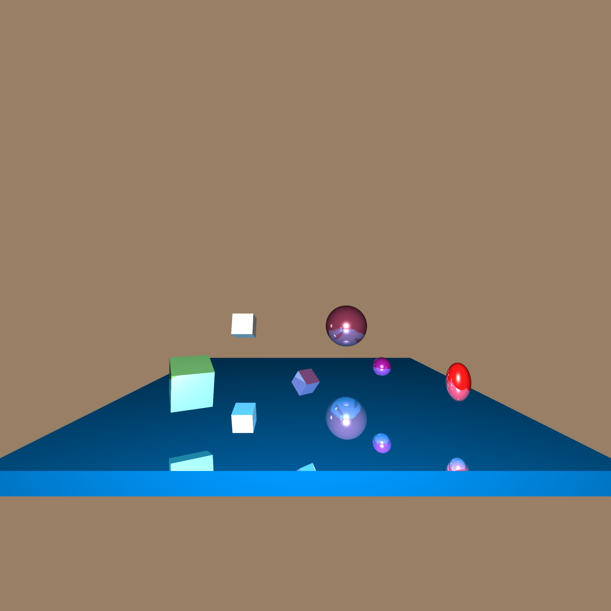

# Raytracer
This is a command line program written in C that renders a 3D scene using software raytracing and produces a highly realistic image.

Sample input files and the generated output files are included in the repository. 

# Compiling and running the raytracer
To compile the program, use the following command:

	make

In a directory containing the source code and the makefile included with the repository. 
To run the program after using make, use the following command: 

	./raytracer.exe input-file

where input-file is a file containing the proper format to describe a scene. 

You can use -v to print verbosely a description of the input file.
The -ptime argument will allow you to print the runtime used by the program.

Recently, the ability to do rendering in parallel was implemented to speedup runtimes when you're feeling a little impatient.
Using the '-t3' argument will instruct the program to use 3 threads while rendering the image.
A maximum of 16 threads can be used. (-t16)

# Input File Syntax:
	
This program supports the rendering of cubes and spheres that can be translated, scaled, and rotated into rectangular prisms and elipses, respectively.
Within the scene, the eye is located at (0,0,0) and is facing towards (0,0,-near)
Color, lighting coefficients and intensity values are between 0.0 and 1.0.
Res is the expected resolution of the output image. 
	
	NEAR n
	LEFT l
	RIGHT r
	BOTTOM b
	TOP t
	RES <width> <height>
	SPHERE <name> <pos x> <pos y> <pos z> <scale x> <scale y> <scale z> <r> <g> <b> <K ambient coefficient> <K diffuse coefficient> <K specular coefficient> <K reflected coefficient> <n brightness>
	CUBE <pos x> <pos y> <pos z> <scale x> <scale y> <scale z> <RX> <RY> <r> <g> <b> <k ambient coefficient> <k diffuse coefficient> <k specular coefficient> <k reflected coefficient> <n brightness>
	LIGHT <name> <pos x> <pos y> <pos z> <Ir - red light intensity> <Ig - green light intensity> <Ib - blue light intensity>
	BACK <r> <g > <b>
	AMBIENT <Ir red ambient light intensity> <Ig green ambient light intensity> <Ib blue ambient light intensity>
	OUTPUT <output filename>
